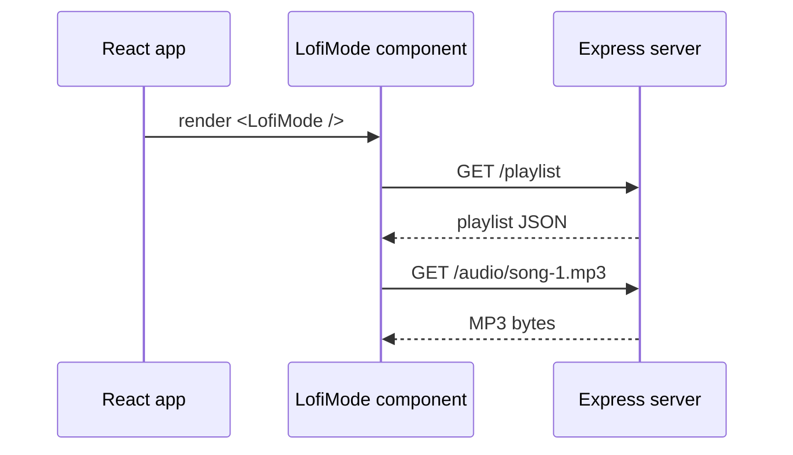

# Lo-fi Mode Microservice

Small CS361-style JavaScript microservice for a standalone React lo-fi player.

The Express server owns the playlist and audio files. The React component asks
for the playlist over HTTP, so it can run in a separate app and process.

## Run it

```bash
npm install
npm start
```

The server runs on `http://127.0.0.1:3050`.

In another terminal:

```bash
npm run demo
```

The demo client calls `GET /playlist?limit=3` and prints the JSON response.

## Use the React component

Copy `react/LofiMode.js` and `react/lofi-mode.css` into a React app, then render:

```jsx
<LofiMode />
```

Or point it at another server:

```jsx
<LofiMode serverUrl="http://127.0.0.1:3050" />
```

The three MP3s are short generated placeholders. Replace them in `audio/` when
the real licensed files and links are ready.

## Request and response

```text
GET http://127.0.0.1:3050/playlist?limit=3
```

```json
{
  "playlistName": "Lo-fi Mode",
  "tracks": [
    {
      "id": "song-1",
      "title": "Rain",
      "url": "http://127.0.0.1:3050/audio/song-1.mp3"
    }
  ]
}
```

## Sequence


